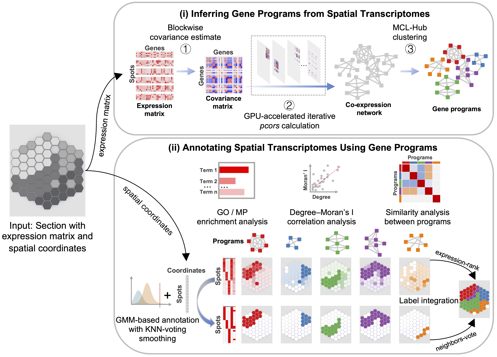

SpacGPA: Spatial and single-cell Gene Program Analysis
=============================================================================

**SpacGPA** is a GPU-accelerated toolkit that annotates spatial transcriptomes through de 
novo interpretable gene programs. It builds co-expression networks via a **Gaussian graphical 
model (GGM)**, identifies programs with a **modified Markov Clustering (MCL)** algorithm, 
performs ontology-based enrichment (Gene Ontology (GO) / Mammalian Phenotype (MP)), and 
applies programs to spatial analyses such as detection of SVGs, spatial domain annotation, 
and label integration.

-----------

**This website hosts the installation guide, in-depth
workflows, and full API reference.**

Quick Links
-----------

- **Installation guide** → :doc:`installation`
- **In-depth workflows** → :doc:`tutorials/index`
- **Full API reference** → :doc:`api/index`

Table of Contents
-----------------
   .. toctree::
      :maxdepth: 1
      :caption: Getting Started

      installation

   .. toctree::
      :maxdepth: 2
      :caption: Tutorials

      tutorials/index

   .. toctree::
      :maxdepth: 2
      :caption: API Reference

      api/index

-----------

Citation
--------------------------

If you use SpacGPA in your work, please cite:  
Xu Y, Chen L, Ma S. *SpacGPA: annotating spatial transcriptomes through de novo interpretable gene programs.* bioRxiv (2025). https://doi.org/10.1101/2025.10.01.679918

Contact
-----------------

* **GitHub**  : https://github.com/MaShisongLab/SpacGPA
* **Issues**  : Please open a ticket on GitHub Issues for bugs or feature requests
* **E-mail**  : sma@ustc.edu.cn